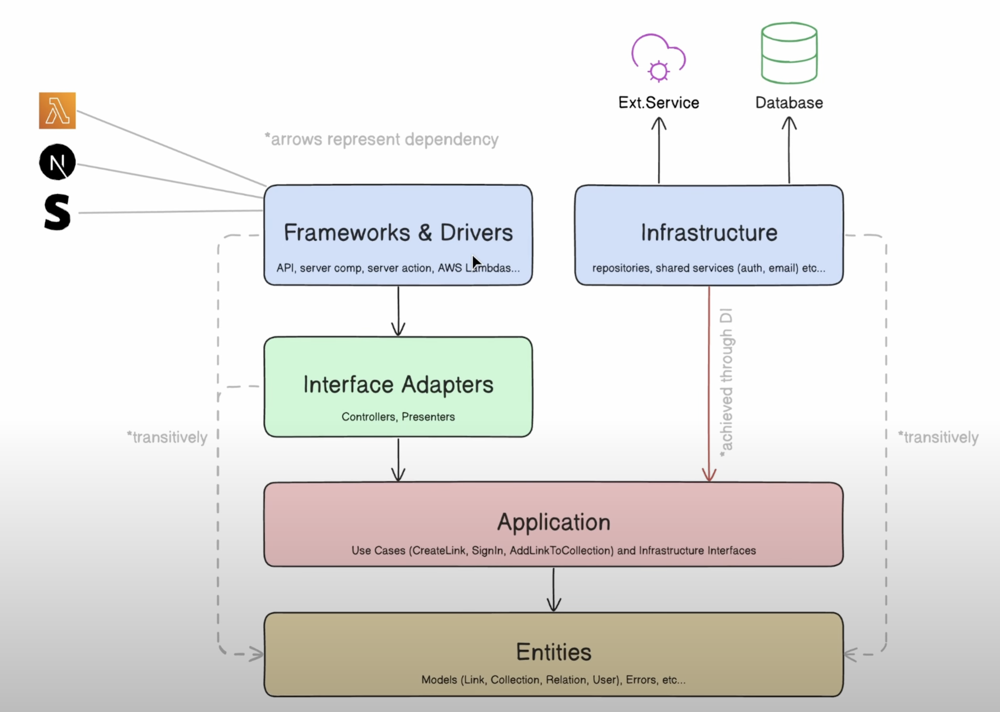

This is a [Next.js](https://nextjs.org) that uses clean architecture to build eveyrthing. This clean architecture is based on the implementation done by Lazar Nikolov.

> **🧑‍💻 Github Repo:** https://github.com/nikolovlazar/nextjs-clean-architecture/tree/main
>
> **📺 Video:** https://www.youtube.com/watch?v=jJVAla0dWJo

## Clean Architecture

For clean architecture to happen there are 5 layers that we are interested in.

- Frameworks & Drivers (API, UI, cron jobs): This is basically contains everything related to the end user. Found primarily in the `/app` folder directory
- Infrastructure (Repositories, Services (auth, email, etc.)): This is basically for everything that connected to a non-end user (e.g. SAAS tools, databases, monitoring tools, etc.) You can find the infrastructure layer in `/src/infrastructure`. The difference between `/src/infrastructure/repositories` and `/src/infrastructure/services` is that the former connects to databases, whereas services are for saas or other external tools (authentication, email, etc.)
- Interface Adapters (Controllers, Presenters): This is where logic related to authentication, form validations, etc. is done. This is also the place where you prevent certain things from showing up on your application, through the use of presenters. You can find this in `/src/interface-adapters/controllers`.
- Application (Use Cases and Infrastructure Interfaces): You can find the application layer in `/src/application`. Use cases only do 1 thing and 1 thing only. If there is a slight difference, you have to create a new user case. (e.g. one use case to add a new Todo, another use case to add a new subtodo to a todo.). In the Interface-adapters, there can be multiple user cases, e.g. create-todo, create-todo-subtask.
- Entities (Models, Errors, Schemas, etc.): You can find the Entities layer in `/src/entities`

> We isolate infrastructure components in it's own layer and consume in the application via DI (Dependency Injection). Infrastructue depends on the application, and not the other way around which most applications are like.

**Copied**

- **Frameworks & Drivers**: keeps all the UI framework functionality. In Next.js, that would be Route Handlers, Server Actions, RSCs, Pages, Components, etc… Everything that uses Next.js / React APIs to achieve _something_.
- **Interface Adapters**: this layer defines Controllers (that orchestrate use-cases) and Presenters (that convert controllers' results into UI-friendly data shape). Controllers handle input validation, before passing it on to the specific use cases.
- **Application**: this is your business logic. This layer contains the main functionality of your app. It keeps the “Use Cases” inside (define the specific operations), and also any Infrastructure interfaces. Use Cases handle authorization checks, because they define individual operations, and authorization checks are performed against a specific operation.
- **Entities**: keeps your model definitions, errors, and anything that defines a shape of data.
- **Infrastructure**: pull in the interfaces from the Application layer, and implement them. This layer keeps shared services (like auth service), database implementations (repositories), and any external services (like OpenAI’s API).

### Benefits of Clean architecture:

1. Indpendent of Framework. (Not really relevant here).
2. Testable. The business rules can be tested without the UI, database, web server, or any other external element.
3. Independent of UI. The UI can be changed easily without changing the rest of the system.
4. Independent of database. You can swap out the database easily, without having a need to refactor your entire application.
5. Independent of any external agency. Your business rules do not need to know anything at all about the outside world.

## Libraries

Here are the list of libraries categoried by their different use cases

1. **Basics**
   - [React](https://react.dev/)
   - [NextJS](https://nextjs.org/)
   - [Typescript](https://www.typescriptlang.org/)
2. **Database**
   - [Turso](https://turso.tech/) - sqlite database
   - [Drizzle](https://orm.drizzle.team/) - database ORM
3. **UI**
   - [Tailwind](https://tailwindcss.com/) - utility-first css framework
   - [Shadcn](https://ui.shadcn.com/) - UI Library
4. **Tooling**
   - [eslint](https://eslint.org/) - make sure that code standards are maintained
   - [prettier](https://prettier.io/) - make sure that code standards are maintained
5. **Clean architecture**
   - [ioctopus](https://github.com/Evyweb/ioctopus) - IOC (Inversion of Control) container for Typescript
   - [zod](https://zod.dev/) - typescript first schema validation

## UI layer (/app)

In `/app` it contains all the UI components and pages used in the application.

In `/app/api` contains all the api endpoints that exists in the application itself.

## Dependencies (/src)

## Testing (/tests)

### Business Logic

We only need to unit test application and interface-adapters as they are the only core business application.

### UI

For UI, you don't have to test everything. Mainly test specific UI pertaining to some kind of business logic. E.g. Conditional rendering, toast appearing after an action, verify history.location after success form submittion, etc.
